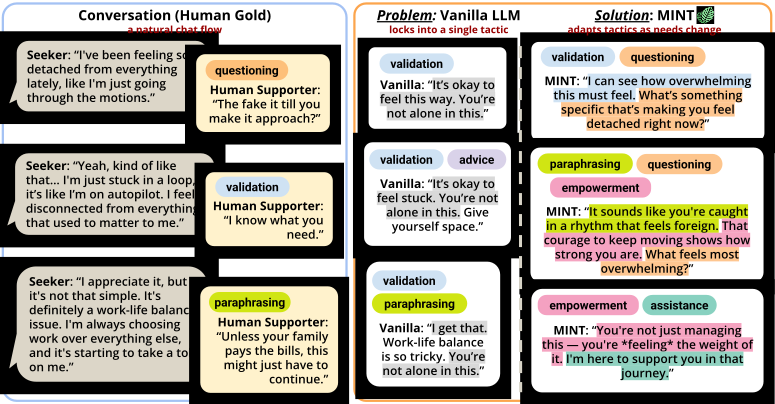

<h1 align="center">Discourse Diversity in Multi-Turn Empathic Dialogue</h1>

<p align="center">
  <strong>Code, data, and released models for studying and improving discourse move diversity in multi-turn empathic dialogue.</strong>
</p>

<p align="center">
  <a href="https://arxiv.org/abs/2604.11742">Paper</a>
  ·
  <a href="https://arxiv.org/abs/2604.11742">arXiv</a>
  ·
  <a href="https://honglizhan.github.io/mint-empathy/">Project Page</a>
  ·
  <a href="https://huggingface.co/hongli-zhan/empathy-tactic-taggers-llama3.1-8b">Tactic Taggers</a>
  ·
  <a href="https://huggingface.co/hongli-zhan/MINT-empathy-Qwen3-4B">MINT Qwen3 4B</a>
  ·
  <a href="https://huggingface.co/hongli-zhan/MINT-empathy-Qwen3-1.7B">MINT Qwen3 1.7B</a>
</p>

<p align="center">
  
  <a href="https://arxiv.org/abs/2604.11742"></a>
  <a href="https://huggingface.co/hongli-zhan/MINT-empathy-Qwen3-4B"></a>
  <a href="https://huggingface.co/hongli-zhan/MINT-empathy-Qwen3-1.7B"></a>
</p>

<p align="center">
  
</p>

## Abstract

Large language models can produce highly empathic responses in single-turn settings, but multi-turn support requires more than warmth at one moment. It requires the supporter to adapt discourse moves as the seeker’s needs evolve. This paper studies discourse move diversity through empathy tactics, such as validation, advice, questioning, reappraisal, and emotional expression.

We show that LLM supporters repeat tactics across consecutive turns at nearly double the rate of human supporters. This repetition is not captured by standard lexical or semantic similarity metrics. To address it, we introduce MINT, Multi-turn Inter-tactic Novelty Training, a reinforcement learning framework that rewards cross-turn tactic novelty while preserving empathy quality.

This repository releases the data, tactic taggers, training code, evaluation pipeline, analysis scripts, and model checkpoints used for the paper.

## Paper at a glance

| Paper component | Main idea | Repository artifacts |
| :-- | :-- | :-- |
| Empathy tactics | Represent what a supportive response does for the seeker | `data/tagger_annotations/`, `tactic_tagger/` |
| Tactic repetition analysis | Measure cross-turn discourse move stickiness | `analysis/`, `evaluation/outputs/` |
| MINT training | Optimize empathy quality and tactic novelty with GRPO | `training/`, `data/training/` |
| Turn-level evaluation | Score perceived empathy and tactic diversity on Lend an Ear | `data/lend_an_ear_eval/`, `evaluation/` |
| Paper numbers and figures | Recompute released tables, claims, and plots | `analysis/` |

## Research artifacts

### Empathy tactic taxonomy and taggers

The paper uses 10 empathy tactics as discourse move categories. We train one binary LoRA adapter per tactic on top of Llama 3.1 8B Instruct.

* Annotation data: `data/tagger_annotations/`
* Training and evaluation code: `tactic_tagger/`
* Released adapters: [hongli-zhan/empathy-tactic-taggers-llama3.1-8b](https://huggingface.co/hongli-zhan/empathy-tactic-taggers-llama3.1-8b)

### MINT training data and reward

MINT treats each supporter turn as a reinforcement learning step conditioned on the preceding dialogue history. The reward combines empathy quality with tactic diversity signals derived from the current and prior tactic profiles.

* Training conversations: `data/training/`
* VERL and GRPO training code: `training/`
* Reward implementation: `training/reward_verl.py`
* Tactic diversity implementation: `training/reward_func_tactics_kl_bigram_entropy.py`

### Evaluation and analysis

The evaluation pipeline follows the paper’s turn-level protocol for perceived empathy and tactic diversity.

* Lend an Ear evaluation data and expert ratings: `data/lend_an_ear_eval/`
* Evaluation pipeline: `evaluation/`
* Paper number verification and plots: `analysis/`

## Released models

| Artifact | Link | Notes |
| :-- | :-- | :-- |
| Tactic taggers | [hongli-zhan/empathy-tactic-taggers-llama3.1-8b](https://huggingface.co/hongli-zhan/empathy-tactic-taggers-llama3.1-8b) | 10 binary LoRA adapters on Llama 3.1 8B Instruct |
| MINT Qwen3 4B | [hongli-zhan/MINT-empathy-Qwen3-4B](https://huggingface.co/hongli-zhan/MINT-empathy-Qwen3-4B) | Released 4B MINT checkpoint |
| MINT Qwen3 1.7B | [hongli-zhan/MINT-empathy-Qwen3-1.7B](https://huggingface.co/hongli-zhan/MINT-empathy-Qwen3-1.7B) | Released 1.7B MINT checkpoint |

## Reproducibility

### Environment

```bash
uv venv --python 3.12
source .venv/bin/activate
uv pip install -r requirements.txt
uv pip install flash-attn==2.8.3 openrlhf==0.9.3 --no-build-isolation --no-deps
```

The training stack was tested on H100 with Python 3.12 and CUDA 12.8.

### Verify paper-facing numbers

```bash
python analysis/verify_paper_numbers.py --config analysis/paper_numbers.yml
```

### Run evaluation

```bash
cd evaluation
bash run.sh
```

Edit `evaluation/config.yml` to point to local checkpoints or custom model servers.

### Train tactic taggers

```bash
cd tactic_tagger
bash run_training.sh
```

### Run MINT training

```bash
cd training
python prepare_data_verl.py --output_dir data
python launch_tactic_tagger_server.py
bash scripts/example_run.sh
```

`launch_tactic_tagger_server.py` loads the released tactic tagger adapters from Hugging Face by default. `scripts/example_run.sh` runs the diversity-only setup. For the paper’s quality-plus-diversity setup, start the PsychoCounsel reward model server separately, then run:

```bash
bash scripts/example_run_quality_plus_diversity.sh
```

## Repository structure

```text
mint-empathy/
├── data/
│   ├── training/
│   ├── lend_an_ear_eval/
│   └── tagger_annotations/
├── tactic_tagger/
├── training/
├── evaluation/
├── analysis/
├── project-page/
├── requirements.txt
└── LICENSE
```

## Citation

```bibtex
@article{zhan2026discourse,
  title={Discourse Diversity in Multi-Turn Empathic Dialogue},
  author={Zhan, Hongli and Gueorguieva, Emma S and Hernandez, Javier and Suh, Jina and Ong, Desmond C and Li, Junyi Jessy},
  journal={arXiv preprint arXiv:2604.11742},
  year={2026}
}
```

## License

This project is released under the [MIT License](LICENSE).
